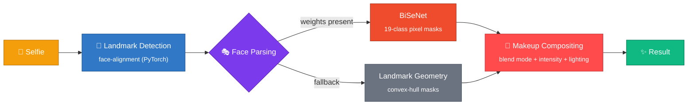

<div align="center">


# 💄 TryMyLook

### See the makeup on your face before you buy it — no filter tricks, just computer vision.

<a href="https://trymylookprototypegit-dncx6weaa3jptnrouebrh4.streamlit.app/"></a>

[](https://www.python.org/)
[](https://streamlit.io/)
[](https://pytorch.org/)
[](#license)
[](#-contributing)
[](#run-it-in-60-seconds)

**[🚀 Live Demo](https://trymylookprototypegit-dncx6weaa3jptnrouebrh4.streamlit.app/)** ·
**[🐛 Report a Bug](../../issues)** ·
**[💡 Request a Feature](../../issues)** ·
**[🤝 Contribute](#-contributing)**

</div>

<br/>

<div align="center">
<table>
<tr>
<td align="center" width="33%">

**📸 Upload**
<br/>
<sub>any selfie, any lighting</sub>

</td>
<td align="center" width="33%">

**💋 Pick a look**
<br/>
<sub>25 shades · 5 products · 5 presets</sub>

</td>
<td align="center" width="33%">

**✨ See it applied**
<br/>
<sub>in real time, with a before/after slider</sub>

</td>
</tr>
</table>

<!-- 🖼️ Drop a before/after GIF or screenshot here — this is the single highest-impact
     addition you can make to this README. Something like:
      -->

</div>

---

## Why this exists

Most "virtual try-on" demos you find online fall into one of two buckets:

- A flat color overlay that doesn't actually know where your lips are in *your* photo — it just guesses a region and paints over it.
- A closed commercial SDK you can look at but never read.

**TryMyLook is the middle ground:** a small, fully inspectable pipeline that does what a production AR-beauty feature actually does under the hood — neural landmark detection, semantic face parsing, and intensity-aware color blending — written in plain Python with nothing hidden.

It's also built to **degrade gracefully**. No GPU? No problem. No deep parsing model downloaded? It falls back automatically and keeps working — that's a deliberate design decision, not a missing feature. See [Architecture](#-architecture) for why.

<br/>

## Run it in 60 seconds

```bash
git clone https://github.com/Ayush-23479/trymylook_prototype.git
cd trymylook_prototype
pip3 install --user -r requirements.txt
streamlit run app.py
```

Or skip local setup entirely — click the badge below and a full dev environment spins up in your browser, dependencies pre-installed, port `8501` forwarded automatically:

[](../../codespaces/new)

> **Heads up on OpenCV:** this repo uses `opencv-python-headless`, which needs the system library `libgl1` on minimal Linux setups (Docker, CI, bare VMs). Codespaces and the included `packages.txt` handle this for you. Running bare-metal Linux yourself? `sudo apt-get install -y libgl1` once, and you're set.

<br/>

## How it works

The whole pipeline is three independent, swappable stages, each its own module in [`src/trymylook/`](src/trymylook/):



<details>
<summary><b>🧭 1. Face detection & landmarks</b> — <code>face_detection.py</code> → <code>DeepLearningFaceDetector</code></summary>
<br/>

Runs the [`face-alignment`](https://github.com/1adrianb/face-alignment) network — a PyTorch model on a ResNet/Hourglass-style backbone — to find **68 facial landmark points**, the same dense scheme classic dlib pipelines use, just predicted by a neural net instead of hand-engineered features. From those points the detector also derives the face bounding box, center, and in-plane rotation angle, which every later stage relies on for masking and alignment.

</details>

<details>
<summary><b>🎭 2. Face parsing / segmentation</b> — <code>segmentation.py</code> → <code>HybridSegmenter</code></summary>
<br/>

Decides *which pixels* are lips, eyelids, skin, and so on — through two interchangeable strategies behind one interface:

| Method | Class | How | Quality |
|---|---|---|---|
| **BiSeNet face parsing** | `BiSeNetSegmenter` | A Bilateral Segmentation Network classifies every pixel into 1 of 19 face classes | Pixel-accurate, robust to odd angles and expressions |
| **Landmark-geometric** | `LandmarkSegmenter` | Convex-hull polygons over the 68 landmarks (lip mask = polygon over mouth points) | Fast, zero extra downloads, dependency-light |

`HybridSegmenter` tries to load BiSeNet on startup. If the ~50 MB weights aren't present — they're [intentionally not committed](#optional-enable-bisenet-for-pixel-accurate-masks) — it silently switches to the landmark method, and everything downstream behaves identically either way. This is exactly why the hosted demo never crashes on a free, CPU-only, memory-capped host.

</details>

<details>
<summary><b>🎨 3. Makeup compositing</b> — <code>makeup_application.py</code> → <code>NeuralMakeupApplicator</code></summary>
<br/>

Applying makeup isn't "paint this color here." For each masked region, the applicator:

- Builds a colored overlay and blends it against the original pixels with one of several blend modes (`multiply`, `overlay`, `screen`, …) — the same compositing math used in image editors, chosen per product (lipstick ≠ foundation).
- Scales blend strength by the **intensity** slider (0–100%).
- Runs texture-preservation and adaptive-lighting passes so results track the photo's real shading instead of sitting flat on top.

`app.py` wires all three stages together behind the Streamlit UI: collect image + selections → `detector → segmenter → applicator` → render result, before/after view, timing metrics, and a download button.

</details>

<br/>

## Architecture

```
                 ┌──────────────────────┐
   selfie  ───▶  │ DeepLearningFaceDet.  │ ──▶ 68 landmarks · bbox · angle
                 └──────────────────────┘
                            │
                            ▼
                 ┌──────────────────────┐
                 │   HybridSegmenter     │
                 │  ┌────────────────┐   │
                 │  │ BiSeNet         │   │ ──▶ per-region binary masks
                 │  │ (if weights     │   │      (lips / eyes / skin / …)
                 │  │  found)         │   │
                 │  ├────────────────┤   │
                 │  │ Landmark        │   │
                 │  │ fallback        │   │
                 │  └────────────────┘   │
                 └──────────────────────┘
                            │
                            ▼
                 ┌──────────────────────┐
                 │ NeuralMakeupApplic.   │ ──▶ blended result image
                 │ blend mode · intensity │
                 │ · adaptive lighting    │
                 └──────────────────────┘
```

**Complete Look** mode runs all four product steps (foundation → blush → eyeshadow → lipstick) through the same pipeline in one pass, batching mask creation when BiSeNet is active — roughly **4× faster** than calling each product individually.

<br/>

## Project structure

```
.
├── app.py                          # Streamlit UI — orchestrates the pipeline
├── src/trymylook/
│   ├── config.py                   # Shades, presets, app constants
│   ├── utils.py                     # Image I/O / resize / validation helpers
│   ├── face_detection.py            # DeepLearningFaceDetector
│   ├── segmentation.py              # HybridSegmenter (BiSeNet + landmark fallback)
│   └── makeup_application.py        # NeuralMakeupApplicator (blending engine)
├── models/face-parsing.PyTorch/    # BiSeNet repo + weights (gitignored)
├── assets/                         # Sample images
├── tests/test_system.py           # End-to-end smoke tests for every module
├── .devcontainer/                 # One-click Codespaces setup
├── .streamlit/config.toml         # Server/theme config for deployment
├── packages.txt                   # apt-level system deps (libgl1, for OpenCV)
├── pyproject.toml                 # Makes `trymylook` pip-installable (-e .)
└── requirements.txt
```

> `requirements.txt` installs this repo itself in editable mode (`-e .`), so `from trymylook.config import ...` works no matter where you run it from.

<div align="center">

| | |
|---|---|
| **Products** | Lipstick · Eyeshadow · Foundation · Blush · Complete Look |
| **Individual shades** | 25 |
| **Curated presets** | 5 |

</div>

<br/>

## Optional: enable BiSeNet for pixel-accurate masks

The app works fully without this — it just uses the landmark fallback. To turn on deep-learning-grade face parsing:

```bash
# 1. Clone the BiSeNet repo into place
git clone https://github.com/zllrunning/face-parsing.PyTorch.git models/face-parsing.PyTorch

# 2. Download the pretrained checkpoint (see that repo's README for the link)
#    and place it at:
#    models/face-parsing.PyTorch/res/cp/79999_iter.pth

# 3. Restart the app
streamlit run app.py
```

You'll know it worked when the startup log switches from `Using landmark-based segmentation only` to `BiSeNet segmenter loaded - Using deep learning mode`.

The checkpoint is excluded from version control on purpose (~50 MB derived artifact, not source) — see [`.gitignore`](.gitignore).

<br/>

## Deployment notes

Running your own fork? A few decisions worth knowing about before you hit them yourself:

| Decision | Why |
|---|---|
| **CPU-only PyTorch pins** (`torch==2.3.0+cpu`) | The default `torch>=2.0.0` resolves to a multi-GB CUDA build that blows past free-tier memory/disk limits for an app that only ever does CPU inference anyway. |
| **BiSeNet weights not committed** | Keeps the repo light and avoids Git LFS — at the cost of the hosted demo always using the (fully functional) landmark fallback. |
| **Minimal `packages.txt`** | Streamlit Cloud's base image doesn't track `apt`'s index 1:1, so over-specifying system packages (we initially listed `libglib2.0-0`) can throw unsatisfiable dependency errors on deploy. Only `libgl1` — the one OpenCV actually needs — stays. |

<br/>

## Roadmap

Open an issue if you're picking one of these up, so effort doesn't collide:

- [ ] Lazy, on-demand BiSeNet weight download for the hosted demo (instead of requiring a manual clone)
- [ ] GPU-aware device selection (`cuda` / `mps` / `cpu`) instead of hardcoded CPU
- [ ] Batch image processing — apply a look across multiple photos at once
- [ ] A standalone REST API layer around the pipeline, decoupled from the Streamlit UI
- [ ] Skin-tone-aware shade recommendations + additional shades
- [ ] `pytest` unit tests + GitHub Actions CI on top of the existing smoke tests

<br/>

## Contributing

Bug fixes, new blend algorithms, more shades, better docs, or just an issue describing what broke — all genuinely welcome.

```bash
git checkout -b feature/your-idea
python3 tests/test_system.py     # smoke-test before you commit
```

Open a PR describing **what** changed and **why**. First-time contributor? Look for issues tagged `good first issue`, or grab anything off the [Roadmap](#roadmap) above.

<br/>

## Tech stack

| Layer | Technology |
|---|---|
| UI | [Streamlit](https://streamlit.io/) |
| Face landmarks | [`face-alignment`](https://github.com/1adrianb/face-alignment) (PyTorch) |
| Face parsing | [BiSeNet](https://github.com/zllrunning/face-parsing.PyTorch) (optional) + custom landmark-geometric fallback |
| Image processing | OpenCV, NumPy, scikit-image, Pillow |
| Inference runtime | PyTorch (CPU), ONNX Runtime |
| Packaging | `pyproject.toml` (editable install) |

<br/>

## License

MIT — see [`LICENSE`](LICENSE). Use it, fork it, ship it.

---

<div align="center">

Built by **[Ayush Verma](https://github.com/Ayush-23479)**

If this saved you time or you're building on it, a ⭐ goes a long way.

</div>
